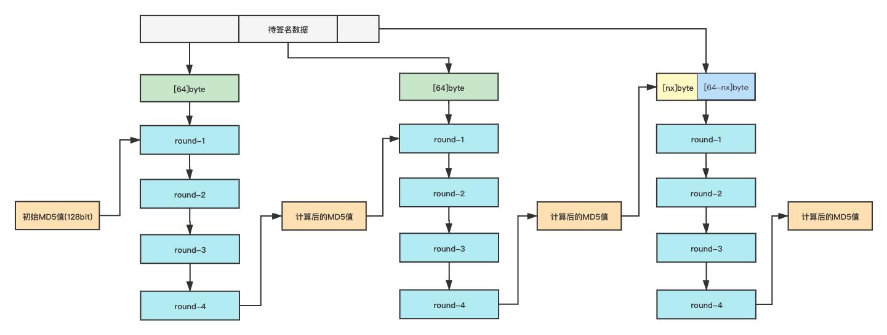
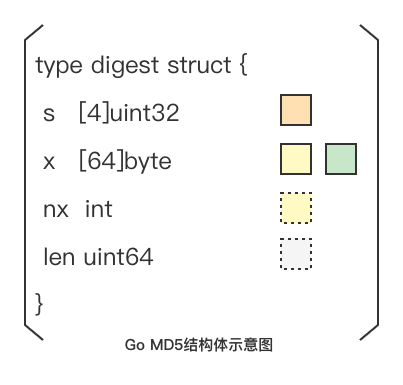

# crypto/md5

## MD5简介

**MD5信息摘要算法**（英语：MD5 Message-Digest Algorithm），一种被广泛使用的[密码散列函数](https://baike.baidu.com/item/密码散列函数/14937715)，可以产生出一个128位（16字节）的散列值（hash value），用于确保信息传输完整一致。MD5由美国密码学家[罗纳德·李维斯特](https://baike.baidu.com/item/罗纳德·李维斯特/700199)（Ronald Linn Rivest）设计，于1992年公开，用以取代[MD4](https://baike.baidu.com/item/MD4/8090275)算法。这套算法的程序在 RFC 1321 标准中被加以规范。1996年后该算法被证实存在弱点，可以被加以破解，对于需要高度安全性的数据，专家一般建议改用其他算法，如[SHA-2](https://baike.baidu.com/item/SHA-2/22718180)。2004年，证实MD5算法无法防止碰撞（collision），因此**不适用于安全性认证**，如[SSL](https://baike.baidu.com/item/SSL/320778)公开密钥认证或是[数字签名](https://baike.baidu.com/item/数字签名/212550)等用途。

以上出自[百度百科](https://baike.baidu.com/item/MD5/212708)



```go
11111
```



```go
222222
```



## MD5处理流程



1. 初始化第一个分组所需要的MD5值（4个uint32的魔数）
2. 整个待签名的数据需要先做分组处理，每64个byte为一组，如果末尾不足64个，需要进行填充
3. 将上一分组的MD5值（第一组没有上一分组就用初始化的MD5）和本分组数据作为输入，经过4轮位移计算生成新的MD5值，如果是最后的分组，该值就是最终的输出

## Go提供的MD5生成方式

Go文档中提供了两种生成MD5的方式

* 一种是调用`New`方法，生成一个`digest`结构体，然后调用`Write`方法进行数据写入，最后调用`digest`结构体所属的`Sum`方法进行输出
* 一种是直接调用包级别的`Sum`方法，传入待签名数据，返回MD5值

```go
package main

import (

  "crypto/md5"

  "fmt"

)

func main() {

  b := []byte("These pretzels are making me thirsty.")

  //方法一

  h := md5.New()

  h.Write(b)

  fmt.Printf("%x\n", h.Sum(nil))  //h.Sum返回[]byte

  //方法二

  fmt.Printf("%x\n", md5.Sum(b))  //md5.Sum返回[16]byte

}
```

既然有两种使用方式，那就应该有对应的应用场景，要不为什么要写两种？

## Go中MD5的实现方式

### 1. digest结构体

Go语言中MD5的计算都依赖于`digest`结构体



如图`digest`结构体包含四个部分，标注的色块为MD5处理流程示意图中的相关位置

`digest.s`：存储的是MD5的值

`digest.x`：存储的是分组后待计算的当前分组内容

`digest.nx`：存储的是当前待处理分组中字符串的长度，也就是`len(digest.x)`的值

`digest.len`：存储的是待签名字符串的总长度

### 2. 方法调用流程

Go语言提供的两种方式底层调用流程基本是一样的，主要是通过三个函数进行签名的

`Reset`：对`digest`结构体中的变量附初始值

`Write`：写入数据并生成中间分组的md5签名，可以多次调用，追加写入，凑够分组就进行一次MD5计算，不够进行计算的数据存入`digest.x`中进行缓存，等待下次调用Write写入

`checkSum`：计算最后分组的填充数据，调用`Write`填充数据，格式化`digest.s`中数据输出MD5值

### 3. 两种方式应用场景

从源码实现角度分析两种方式的应用场景

`md5.New()方式`：通过`Write`方法追加写入，对于像请求签名这样需要拼合字符串的场景可以减少内存分配。再`Sum`方法的调用过程中会拷贝`digest`结构体及MD5返回值，优点是可以在生成MD5后继续追加数据生成新的值，缺点就是有多余的拷贝

`md5.Sum方式`：需要开发人员自己拼合\[\]byte后调用，在预先分配内存的场景下速度更快，但是伴随的就会有内存回收的问题

## MD5长度扩展攻击

MD5虽然已经被证明有安全问题，但是在现行的接口签名中还是有部分使用。相应的签名格式定义问题就可能引发长度扩展攻击

一般情况下在一个openapi平台注册之后，会生成AppID和AppKey。请求的时候需要明文传输AppID和其他请求参数，并且将请求串拼上AppKey后进行MD5签名，并传输MD5签名，服务端接收后按照同样的规则进行签名对比MD5值，确认数据是否被篡改

常见的签名格式如下，其中第一种就可能会被长度扩展攻击

1. MD5\(AppKey+请求串\)
2. MD5\(AppKey+请求串+AppKey\)
3. MD5\(请求串+AppKey\)

假设现在有一个根据订单id批量获取订单信息的接口，签名拼接方式如下

```text
sign = md5(43f55d8396d0982fd62666883a9b3730appid=111orderIds=11111,999)
```

请求接口时参数如下

```text
appid=111&orderIds=11111,999&sign=745ae5112958a62414d673befafe2626
```

由于openapi的签名算法，数据拼接格式，以及AppKey对外开放的，也就是已知的。假定我们要在参数中追加两个id`,22222,33333`，具体的攻击步骤如下

1. 根据明文和AppKey的长度可以推测整个签名字符串的长度，并且可以根据md5算法计算出最后分组的填充字符串
2. 我们篡改后的明文就会变成

   ```text
   appid=111&orderIds=11111,999 + 填充字符串 + ,22222,33333
   ```

3. 将现有的sign值\(745ae5112958a62414d673befafe2626\)初始化到`digest.s`中，将`,22222,33333`追加写入待计算的`digest.x`然后计算MD5值就能得到延长后的MD5值
4. 篡改后的请求如下

   ```text
   appid=111&orderIds=11111,999 + 填充字符串 + ,22222,33333&sign=d29332e75214b63c173b5485c7f07d45
   ```

这样服务端是可以通过验签操作的，至于能不能成功返回查询就要看服务端怎么解析请求参数了

实现代码如下

```go
package test

import (

  "encoding/hex"

  "fmt"

  "testing"

  "github.com/coredumptoday/hashpump/md5"

)

const KEY = "43f55d8396d0982fd62666883a9b3730"

func TestMD5Pump(t *testing.T) {

  data := "appid=111orderIds=11111,999"

  injectData := ",22222,33333"

  originMd5Str := md5.Sum([]byte(KEY + data))

  fmt.Println("origin:", hex.EncodeToString(originMd5Str[:]), KEY+data)

  newSign, newStr, err := md5.HashPump(hex.EncodeToString(originMd5Str[:]), data, injectData, len(KEY))

  fmt.Println(hex.EncodeToString(newSign))

  fmt.Println(string(newStr))

  fmt.Println(err)

  m := md5.Sum([]byte(KEY + string(newStr)))

  fmt.Println(hex.EncodeToString(m[:]))

  if hex.EncodeToString(m[:]) == hex.EncodeToString(newSign) {
    fmt.Println("It Worked!!!")
  }

}
```

