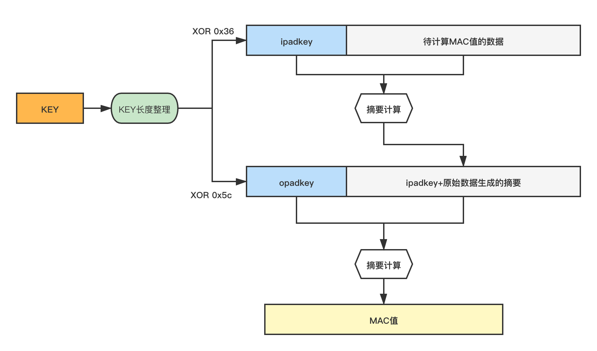

# hmac

## 概述


hmac包实现了美国联邦信息处理标准198出版物中定义的键控哈希消息验证码(hmac)。HMAC是一种使用密钥对消息进行签名的加密散列。接收方通过使用相同的键重新计算哈希来验证哈希。


## 示例

### MAC值计算

### MAC值校验


接收者应该使用`hmac.Equal`比较`MAC`值，以防止基于时间的`侧信道攻击`


## MAC值计算方式



### Go语言实现
#### marshalable 接口

```go
type marshalable interface {
    MarshalBinary() ([]byte, error)
    UnmarshalBinary([]byte) error
}
```
