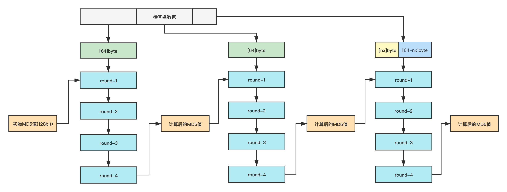

# md5

## 概述


md5包实现了 [RFC 1321](https://rfc-editor.org/rfc/rfc1321.html) 中定义的`MD5`哈希算法



`MD5`算法的密码学可靠性已经被攻破，不适用于安全应用


## 常量


```go
const BlockSize = 64
const Size = 16
```


计算hash值过程中，输入数据以`[BlockSize]byte`大小进行分组，凑够一组就能进行一次hash迭代，最终计算结果保存在一个`[Size]byte`大小的**数组**中返回

## 示例

### 计算字符串MD5值

Go提供了两种计算MD5的调用方式


```go
data := []byte("These pretzels are")
data = append(data, " making me thirsty."...)
fmt.Printf("%x\n", md5.Sum(data))

//output
//b0804ec967f48520697662a204f5fe72
```



```go
func Sum(data []byte) [Size]byte
```


根据方法签名，调用时需要传入待计算的字符串，返回值为一个`Size`大小的`byte`数组

该调用方式是对`对象调用方式`的封装，需要自己拼接待计算字符串，调用一次计算一次，每次都需要重新构造数据，不能做`序列化`操作


```go
h := md5.New()
h.Write([]byte("These pretzels are"))
h.Write([]byte(" making me thirsty."))
fmt.Printf("%x\n", h.Sum(nil))

//output
//b0804ec967f48520697662a204f5fe72
```


调用`md5.New()`生成一个`md5.digest`结构体对象，并赋初始值。`md5.digest`实现了`hash.Hash`接口。关于`hash.Hash`的相关说明请参考[接口说明](./interfaces.md)。`digest.Sum`方法返回值类型为**切片**，这点和包调用方式不同

### 计算文件MD5值


```go
f, err := os.Open("file.txt")
if err != nil {
    log.Fatal(err)
}
defer f.Close()

h := md5.New()
if _, err := io.Copy(h, f); err != nil {
    log.Fatal(err)
}

fmt.Printf("%x\n", h.Sum(nil))
```


文件MD5值计算是以`对象调用方式`追加写的形式实现的

### 序列化/反序列化


```go
h := md5.New()
h.Write([]byte("These pretzels are"))

mb, err := h.(encoding.BinaryMarshaler).MarshalBinary()
if err != nil {
    fmt.Println(err)
}
fmt.Println(mb)

nh := md5.New()
err = nh.(encoding.BinaryUnmarshaler).UnmarshalBinary(mb)
if err != nil {
    fmt.Println(err)
}

h.Write([]byte(" making me thirsty."))
nh.Write([]byte(" making me thirsty."))

fmt.Printf("%x\n", h.Sum(nil))
fmt.Printf("%x\n", nh.Sum(nil))
```


## MD5的计算方式



MD5的计算流程如图所示
- 每凑够一组`[BlockSize]byte`就进行一轮迭代
- 每轮迭代参与的数据为`前一组计算的MD5值`和`本组数据`
- 每轮迭代经历四组运算（round1~round4），每组`16`次运行，输出结果为本轮迭代后的MD5值
- 第一个分组计算时，由于没有`前一组计算的MD5值`需要使用默认的一组魔数作为初始值
- 最后一个分组需要做填充操作，使满足`(待处理字节数+填充字节数) % BlockSize == 0`
- 填充规则，头尾为固定长度`1+8`个字节，需要计算出中间`0`值的个数
    - 1字节的结束标识，取值为`0x80`
    - 0-63个字节的`0`值填充
    - 8字节长度，保存待计算字符串的字节数


### Go语言实现
#### digest结构体


> 如图`digest`结构体包含四个部分，标注的色块为MD5处理流程示意图中的相关位置

Go语言中MD5的计算都依赖于`digest`结构体

`digest.s`：存储的是MD5的值（包括`初始值`和`前一组的计算结果`）

`digest.x`：存储的是没有凑够分组的待计算字符串

`digest.nx`：存储的是`len(digest.x)`

`digest.len`：存储的是调用`Write`方法写入的字节数

#### 方法调用流程

无论是`MD5包方法调用`还是`对象调用方式`，底层的调用逻辑基本一致

1. New一个`digest`对象
2. 调用`digest.Reset`方法，对结构体中的变量赋初值
3. 调用`digest.Write`方法写入数据**并进行计算**
4. 调用`digest.checkSum`方法，生成填充数据，调用`digest.Write`方法，写入填充数据并计算最后的数据分组，生成最终结果

#### Write方法解析
```go
func (d *digest) Write(p []byte) (nn int, err error) {
	//获取写入字节数，更新d.len的值
	nn = len(p)
	d.len += uint64(nn)
	
	//如果d.x中存有待处理的数据，将本次输入拷贝到d.x中，如果能凑够 BlockSize 则进行一轮迭代
	if d.nx > 0 {
		n := copy(d.x[d.nx:], p)
		d.nx += n
		if d.nx == BlockSize {
			//如果凑够一个分组就进行计算
			if haveAsm {
				block(d, d.x[:]) //汇编实现迭代计算
			} else {
				blockGeneric(d, d.x[:]) //Go语言实现迭代计算
			}
			d.nx = 0
		}
		//更改偏移量，将写入d.x中的字节去掉
		p = p[n:]
	}
	
	//如果 p 能凑够至少一个分组，就进行计算
	if len(p) >= BlockSize {
		n := len(p) &^ (BlockSize - 1)
        /* 等式解析
         * n := len(p) &^ (BlockSize - 1)
         * -> len(p) ^ (len(p) & (BlockSize - 1))
         * -> len(p) ^ (len(p) % BlockSize)
         *
         * 计算过程解析
         * 已知 BlockSize = 64，二进制表示为 0000000001000000
         * len(p) % 64，取值范围是 0 ~ 63，
         * 二进制会落在 0000000001[000000] 低位的六个 0 的范围内
         * 所以 xxxxxxxxxxxxxxxx
         *   % 0000000001000000
         * 可以转换为 xxxxxxxxxxxxxxxx
         *        & 0000000000111111
         *        -------------------- len(p) & (BlockSize - 1)
         *    结果   0000000000xxxxxx
         *        ^ xxxxxxxxxxxxxxxx
         *        -------------------- len(p) ^ (len(p) & (BlockSize - 1))
         *    结果   xxxxxxxxxx000000   n = BlockSize的最大整数倍
         *
         * go源码中位运算的方式效率更高，但是需要的条
         * 是 BlockSize 必须是 2^n 这种形式
         */
		if haveAsm {
			block(d, p[:n]) //汇编实现迭代计算
		} else {
			blockGeneric(d, p[:n]) //Go语言实现迭代计算
		}
		
        //更改偏移量，将进行过计算的数据去掉
		p = p[n:]
	}
	
	//最后凑不满的数据就会被写入d.x中等待下次调用时参与运算
	if len(p) > 0 {
		d.nx = copy(d.x[:], p)
	}
	return
}
```

#### 填充计算解析
```go
/*
    填充规则，头尾为固定长度 1+8 个字节，需要计算出中间 0 值的个数
    - 1字节的结束标识，取值为 0x80
    - 0-63个字节的 0 值填充
    - 8字节长度，保存待计算字符串的字节数
*/

//tmp数组第 0 个位置为 0x80，其他位置均为 0 值，0x80是超出ASCII范围的第一个值
tmp := [1 + 63 + 8]byte{0x80}

// 计算pad的值，这段比较不好理解，可以参考sha1或者sha256相应的写法
// 分两种情况讨论 d.len <= 55 比较好理解，不做解释
// 当 d.len > 55 时，计算为负数，由于 d.len 是uint64，相减结果只能为正数，这样就演变成借位减法
// 55 - d.len < 0 时 代码演变为 (2^64 + 55 - d.len) % 64
// 只要 2^n + 55 >= d.len，n就成立，n=64是因为uint64的原因
pad := (55 - d.len) % 64
binary.LittleEndian.PutUint64(tmp[1+pad:], d.len<<3)
// 1 << 3 = 8 => d.len << 3 == d.len * 8 = 输入数据的比特位数量
d.Write(tmp[:1+pad+8])
```