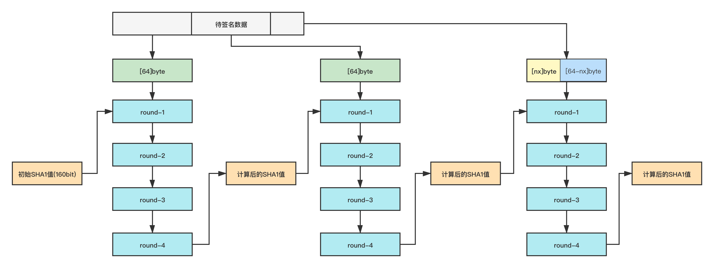
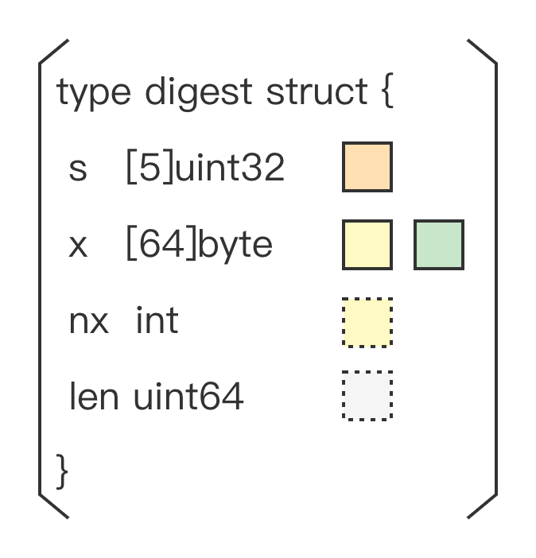

# sha1

## 概述


sha1包实现了 [RFC 3174](https://www.rfc-editor.org/rfc/rfc3174.html) 中定义的`SHA1`哈希算法



`SHA1`算法的密码学可靠性已经被攻破，不适用于安全应用


## 常量


```go
const BlockSize = 64
const Size = 20
```


计算hash值过程中，输入数据以`[BlockSize]byte`大小进行分组，凑够一组就能进行一次hash迭代，最终计算结果保存在一个`[Size]byte`大小的**数组**中返回

## 示例

### 计算字符串SHA1值

Go提供了两种计算SHA1的调用方式


```go
data := []byte("These pretzels are")
data = append(data, " making me thirsty."...)
fmt.Printf("%x\n", sha1.Sum(data))

//output
//7a0f82aac45ddc67ac3652f01fb5f731ec8f64a6
```



```go
func Sum(data []byte) [Size]byte
```


根据方法签名，调用时需要传入待计算的字符串，返回值为一个`Size`大小的`byte`数组

该调用方式是对`对象调用方式`的封装，需要自己拼接待计算字符串，调用一次计算一次，每次都需要重新构造数据，不能做`序列化`操作


```go
h := sha1.New()
h.Write([]byte("These pretzels are"))
h.Write([]byte(" making me thirsty."))
fmt.Printf("%x\n", h.Sum(nil))

//output
//7a0f82aac45ddc67ac3652f01fb5f731ec8f64a6
```


调用`sha1.New()`生成一个`sha1.digest`结构体对象，并赋初始值。`sha1.digest`实现了`hash.Hash`接口。关于`hash.Hash`的相关说明请参考[接口说明](./interfaces.md)。`digest.Sum`方法返回值类型为**切片**，这点和包调用方式不同

### 计算文件SHA1值


```go
f, err := os.Open("file.txt")
if err != nil {
    log.Fatal(err)
}
defer f.Close()

h := sha1.New()
if _, err := io.Copy(h, f); err != nil {
    log.Fatal(err)
}

fmt.Printf("%x\n", h.Sum(nil))
```


文件SHA1值计算是以`对象调用方式`追加写的形式实现的

### 序列化/反序列化


```go
h := sha1.New()
h.Write([]byte("These pretzels are"))

mb, err := h.(encoding.BinaryMarshaler).MarshalBinary()
if err != nil {
    fmt.Println(err)
}
fmt.Println(mb)

nh := sha1.New()
err = nh.(encoding.BinaryUnmarshaler).UnmarshalBinary(mb)
if err != nil {
    fmt.Println(err)
}

h.Write([]byte(" making me thirsty."))
nh.Write([]byte(" making me thirsty."))

fmt.Printf("%x\n", h.Sum(nil))
fmt.Printf("%x\n", nh.Sum(nil))
```


### ConstantTimeSum


```go
type constantSum interface {
    ConstantTimeSum(in []byte) []byte
}
h := sha1.New()
h.Write([]byte("These pretzels are"))
h.Write([]byte(" making me thirsty."))
fmt.Printf("%x\n", h.(constantSum).ConstantTimeSum(nil))

//output
//7a0f82aac45ddc67ac3652f01fb5f731ec8f64a6
```


`sha1.digest`对象还包含一个`ConstantTimeSum`方法，该方法是`Sum`方法的替代，根据官方说明`ConstantTimeSum`的计算结果和`Sum`一致，但是运行时长是**固定的**


防止基于时间的`侧信道攻击`请使用`ConstantTimeSum`，Golang自身`tls`计算`hmac-sha1`使用的就是`ConstantTimeSum`


## SHA1的计算方式



SHA1的计算流程如图所示
- 每凑够一组`[BlockSize]byte`就进行一轮迭代
- 每轮迭代参与的数据为`前一组计算的SHA1值`和`本组数据`
- 每轮迭代经历四组运算（round1~round4），每组`20`次运行，输出结果为本轮迭代后的SHA1值
- 第一个分组计算时，由于没有`前一组计算的SHA1值`需要使用默认的一组魔数作为初始值
- 最后一个分组需要做填充操作，使满足`(待处理字节数+填充字节数) % BlockSize == 0`
- 填充规则，头尾为固定长度`1+8`个字节，需要计算出中间`0`值的个数
    - 1字节的结束标识，取值为`0x80`
    - 0-63个字节的`0`值填充
    - 8字节长度，保存待计算字符串的字节数

### Go语言实现
#### digest结构体



> 如图`digest`结构体包含四个部分，标注的色块为SHA1处理流程示意图中的相关位置

Go语言中SHA1的计算都依赖于`digest`结构体

`digest.s`：存储的是SHA1的值（包括`初始值`和`前一组的计算结果`）

`digest.x`：存储的是没有凑够分组的待计算字符串

`digest.nx`：存储的是`len(digest.x)`

`digest.len`：存储的是调用`Write`方法写入的字节数

#### 方法调用流程

无论是`SHA1包方法调用`还是`对象调用方式`，底层的调用逻辑基本一致

1. New一个`digest`对象
2. 调用`digest.Reset`方法，对结构体中的变量赋初值
3. 调用`digest.Write`方法写入数据**并进行计算**
4. 调用`digest.checkSum`方法，生成填充数据，调用`digest.Write`方法，写入填充数据并计算最后的数据分组，生成最终结果

#### Write方法解析
```go
func (d *digest) Write(p []byte) (nn int, err error) {
    //获取写入字节数，更新d.len的值
    nn = len(p)
    d.len += uint64(nn)
    //如果d.x中存有待处理的数据，将本次输入拷贝到d.x中，如果能凑够 BlockSize 则进行一轮迭代
    if d.nx > 0 {
        n := copy(d.x[d.nx:], p)
        d.nx += n
        if d.nx == chunk {
            //如果凑够一个分组就进行计算
            block(d, d.x[:])	//block方法中会根据CPU参数判断执行汇编方法还是go方法
            d.nx = 0
        }
        //更改偏移量，将写入d.x中的字节去掉
        p = p[n:]
    }

    //如果 p 能凑够至少一个分组，就进行计算
    if len(p) >= chunk {
        n := len(p) &^ (chunk - 1)
        /*
         * n := (len(p) / BlockSize) * BlockSize
         * 该方式和上面结果等价，作用是计算n的位置，n
         * 前的数据是 BlockSize 的整数倍，n到结尾的
         * 据是凑不够 BlockSize 大小的数据
         *
         * go源码中位运算的方式效率更高，但是需要的条
         * 是 BlockSize 必须是 2^n 这种形式
         */
        block(d, p[:n])	//block方法中会根据CPU参数判断执行汇编方法还是go方法
        //更改偏移量，将进行过计算的数据去掉
        p = p[n:]
    }

    //最后凑不满的数据就会被写入d.x中等待下次调用时参与运算
    if len(p) > 0 {
        d.nx = copy(d.x[:], p)
    }
    return
}
```