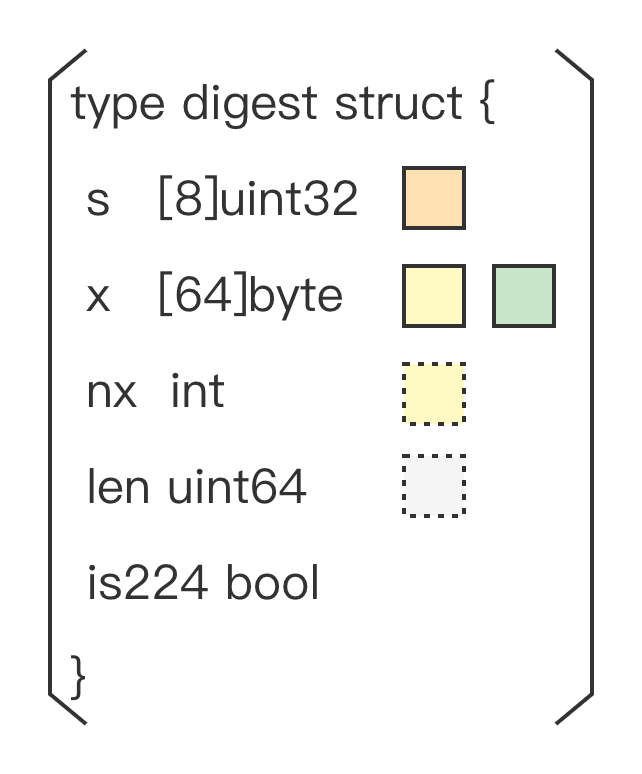

# sha256/224

## 概述


sha256包实现了`FIPS 180-4`中定义的`SHA224`和`SHA256`哈希算法


## 常量


```go
const BlockSize = 64
const Size = 32
const Size224 = 28
```


计算hash值过程中，输入数据以`[BlockSize]byte`大小进行分组，凑够一组就能进行一次hash迭代，最终计算结果保存在一个`[Size]byte`大小的**数组**中返回，如果是`SHA224`则需要对返回的数组进行截断，只返回前`28`个`byte`

## 示例

### 计算字符串SHA256/224值

Go提供了两种调用方式




```go
data := []byte("These pretzels are")
data = append(data, " making me thirsty."...)
fmt.Printf("%x\n", sha256.Sum256(data))

//output
//86bda720f645a43e64f123e885577ab415d7146bf8fc7da3285ee5b99f52766f
```





```go
data := []byte("These pretzels are")
data = append(data, " making me thirsty."...)
fmt.Printf("%x\n", sha256.Sum224(data))

//output
//f37ba2701f3dee0267d068e2a86b164a03c6a7d7c498fdb32b04f09b
```







```go
func Sum256(data []byte) [Size]byte
```

根据方法签名，调用时需要传入待计算的字符串，返回值为一个`Size`大小的`byte`数组




```go
func Sum224(data []byte) (sum224 [Size224]byte)
```

根据方法签名，调用时需要传入待计算的字符串，返回值为一个`Size224`大小的`byte`数组



该调用方式是对`对象调用方式`的封装，需要自己拼接待计算字符串，调用一次计算一次，每次都需要重新构造数据，不能做`序列化`操作




```go
h256 := sha256.New()
h256.Write([]byte("These pretzels are"))
h256.Write([]byte(" making me thirsty."))
fmt.Printf("%x\n", h256.Sum(nil))

//output
//86bda720f645a43e64f123e885577ab415d7146bf8fc7da3285ee5b99f52766f
```

调用`sha256.New()`生成一个`sha256.digest`结构体对象，并赋初始值。`sha256.digest`实现了`hash.Hash`接口。关于`hash.Hash`的相关说明请参考[接口说明](./interfaces.md)。`digest.Sum`方法返回值类型为**切片**，这点和包调用方式不同




```go
h224 := sha256.New224()
h224.Write([]byte("These pretzels are"))
h224.Write([]byte(" making me thirsty."))
fmt.Printf("%x\n", h224.Sum(nil))

//output
//f37ba2701f3dee0267d068e2a86b164a03c6a7d7c498fdb32b04f09b
```

调用`sha256.New224()`生成一个`sha256.digest`结构体对象，并赋初始值。`sha256.digest`实现了`hash.Hash`接口。关于`hash.Hash`的相关说明请参考[接口说明](./interfaces.md)。`digest.Sum`方法返回值类型为**切片**，这点和包调用方式不同



### 计算文件SHA256/224值




```go
f, err := os.Open("file.txt")
if err != nil {
    log.Fatal(err)
}
defer f.Close()

h256 := sha256.New()
if _, err := io.Copy(h256, f); err != nil {
    log.Fatal(err)
}

fmt.Printf("%x\n", h256.Sum(nil))
```

文件`SHA256`值计算是以`对象调用方式`追加写的形式实现的




```go
f, err := os.Open("file.txt")
if err != nil {
    log.Fatal(err)
}
defer f.Close()

h224 := sha256.New224()
if _, err := io.Copy(h224, f); err != nil {
    log.Fatal(err)
}

fmt.Printf("%x\n", h224.Sum(nil))
```

文件`SHA224`值计算是以`对象调用方式`追加写的形式实现的



### 序列化/反序列化




```go
h := sha256.New()
h.Write([]byte("These pretzels are"))

mb, err := h.(encoding.BinaryMarshaler).MarshalBinary()
if err != nil {
    fmt.Println(err)
}
fmt.Println(mb)

nh := sha256.New()
err = nh.(encoding.BinaryUnmarshaler).UnmarshalBinary(mb)
if err != nil {
    fmt.Println(err)
}

h.Write([]byte(" making me thirsty."))
nh.Write([]byte(" making me thirsty."))

fmt.Printf("%x\n", h.Sum(nil))
fmt.Printf("%x\n", nh.Sum(nil))
```





```go
h := sha256.New224()
h.Write([]byte("These pretzels are"))

mb, err := h.(encoding.BinaryMarshaler).MarshalBinary()
if err != nil {
    fmt.Println(err)
}
fmt.Println(mb)

nh := sha256.New224()
err = nh.(encoding.BinaryUnmarshaler).UnmarshalBinary(mb)
if err != nil {
    fmt.Println(err)
}

h.Write([]byte(" making me thirsty."))
nh.Write([]byte(" making me thirsty."))

fmt.Printf("%x\n", h.Sum(nil))
fmt.Printf("%x\n", nh.Sum(nil))
```




## SHA256/224的计算方式


SHA256/224的计算流程如图所示
- 每凑够一组`[BlockSize]byte`就进行一轮迭代
- 每轮迭代参与的数据为`前一组计算的SHA256值`和`本组数据`
- 每轮迭代经历两组运算（round1、round2），每组`64`次运行，输出结果为本轮迭代后的SHA256值
- 第一个分组计算时，由于没有`前一组计算的SHA256值`需要根据需要计算的是`SHA256`还是`SHA224`选择不同的魔数作为初始值
- 最后一个分组需要做填充操作，使满足`(待处理字节数+填充字节数) % BlockSize == 0`
- 填充规则，头尾为固定长度`1+8`个字节，需要计算出中间`0`值的个数
    - 1字节的结束标识，取值为`0x80`
    - 0-63个字节的`0`值填充
    - 8字节长度，保存待计算字符串的字节数
- `SHA224`的返回结果是在`256bit`计算结果的基础上截取前`224bit`返回


### Go语言实现
#### digest结构体



> 如图`digest`结构体包含五个部分，标注的色块为SHA256处理流程示意图中的相关位置

Go语言中SHA256/224的计算都依赖于`digest`结构体

`digest.s`：存储的是`SHA256`的值（包括`初始值`和`前一组的计算结果`）

`digest.x`：存储的是没有凑够分组的待计算字符串

`digest.nx`：存储的是`len(digest.x)`

`digest.len`：存储的是调用`Write`方法写入的字节数

`digest.is224`：标识进行是`SHA256`还是`SHA224`的计算

#### 方法调用流程

无论是`SHA256包方法调用`还是`对象调用方式`，底层的调用逻辑基本一致

1. New一个`digest`对象，标识是进行`SHA256`还是`SHA224`的计算
2. 调用`digest.Reset`方法，根据`digest.is224`的取值，对结构体中的变量赋不同的初值
3. 调用`digest.Write`方法写入数据**并进行计算**
4. 调用`digest.checkSum`方法，生成填充数据，调用`digest.Write`方法，写入填充数据并计算最后的数据分组，生成最终结果

#### Write方法解析
```go
func (d *digest) Write(p []byte) (nn int, err error) {
    //获取写入字节数，更新d.len的值
    nn = len(p)
    d.len += uint64(nn)
    //如果d.x中存有待处理的数据，将本次输入拷贝到d.x中，如果能凑够 BlockSize 则进行一轮迭代
    if d.nx > 0 {
        n := copy(d.x[d.nx:], p)
        d.nx += n
        if d.nx == chunk { //如果凑够一个分组就进行计算
            block(d, d.x[:]) //block方法中会根据CPU参数判断执行汇编方法还是go方法
            d.nx = 0
        }
        //更改偏移量，将写入d.x中的字节去掉
        p = p[n:]
    }

    //如果 p 能凑够至少一个分组，就进行计算
    if len(p) >= chunk {
        n := len(p) &^ (chunk - 1)
        /* 等式解析
         * n := len(p) &^ (BlockSize - 1)
         * -> len(p) ^ (len(p) & (BlockSize - 1))
         * -> len(p) ^ (len(p) % BlockSize)
         *
         * 计算过程解析
         * 已知 BlockSize = 64，二进制表示为 0000000001000000
         * len(p) % 64，取值范围是 0 ~ 63，
         * 二进制会落在 0000000001[000000] 低位的六个 0 的范围内
         * 所以 xxxxxxxxxxxxxxxx
         *   % 0000000001000000
         * 可以转换为 xxxxxxxxxxxxxxxx
         *        & 0000000000111111
         *        -------------------- len(p) & (BlockSize - 1)
         *    结果   0000000000xxxxxx
         *        ^ xxxxxxxxxxxxxxxx
         *        -------------------- len(p) ^ (len(p) & (BlockSize - 1))
         *    结果   xxxxxxxxxx000000   n = BlockSize的最大整数倍
         *
         * go源码中位运算的方式效率更高，但是需要的条
         * 是 BlockSize 必须是 2^n 这种形式
         */
        block(d, p[:n]) //block方法中会根据CPU参数判断执行汇编方法还是go方法
        //更改偏移量，将进行过计算的数据去掉
        p = p[n:]
    }

    //最后凑不满的数据就会被写入d.x中等待下次调用时参与运算
    if len(p) > 0 {
        d.nx = copy(d.x[:], p)
    }
    return
}
```
#### 填充计算解析
```go
/*
    填充规则，头尾为固定长度 1+8 个字节，需要计算出中间 0 值的个数
   - 1字节的结束标识，取值为 0x80
   - 0-63个字节的 0 值填充
   - 8字节长度，保存待计算字符串的字节数
*/

len := d.len
//tmp数组第 0 个位置为 0x80，其他位置均为 0 值，0x80是超出ASCII范围的第一个值
var tmp [64]byte
tmp[0] = 0x80

//这个版本的填充比MD5那版要容易理解的多
//len%64 的取值范围是 0-63
if len%64 < 56 {    //len%64 的取值范围是 0-55
    d.Write(tmp[0 : 56-len%64]) //填充 0x80 + [0-55]个0值
} else {    //len%64 的取值范围是 56-63
    d.Write(tmp[0 : 64+56-len%64]) //填充 0x80 + [56-63]个0值
}

// Length in bits.
len <<= 3 // 等价于 输入数据总比特位数
binary.BigEndian.PutUint64(tmp[:], len)
d.Write(tmp[0:8])
```