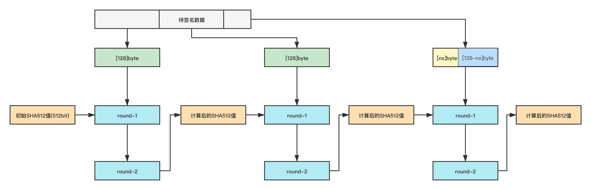
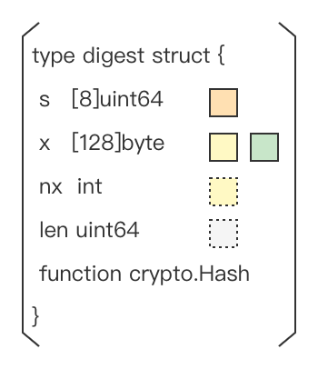

# sha256/224

## 概述


sha512包实现了`FIPS 180-4`中定义的`SHA512` `SHA384` `SHA512/256` `SHA512/224`哈希算法


## 常量


```go
const BlockSize = 128
const Size = 64
const Size224 = 28
const Size256 = 32
const Size384 = 48
```


计算hash值过程中，输入数据以`[BlockSize]byte`大小进行分组，凑够一组就能进行一次hash迭代，最终计算结果保存在一个`[Size]byte`大小的**数组**中返回，如果是`SHA384` `SHA512/256` `SHA512/224`则需要对返回的数组进行截断

## 示例

### 计算字符串sha512/384/256/224值

Go提供了两种调用方式




```go
data := []byte("These pretzels are")
data = append(data, " making me thirsty."...)
fmt.Printf("%x\n", sha512.Sum512(data))

//output
//c2db05e41d963524d2af33a5fe5402b0f629ea6e39f785e8efc8de653270f2668ce6b02dbf2a658f72a1ebe8099de8e2fb00e330972f0eb550ee7484a11433fa
```





```go
data := []byte("These pretzels are")
data = append(data, " making me thirsty."...)
fmt.Printf("%x\n", sha512.Sum384(data))

//output
//da13ae04a4ac17f168be581db27c45d8259fa0d269b295f5bb060fc4d5472366534b3434394633e6b00f1b12954572d2
```





```go
data := []byte("These pretzels are")
data = append(data, " making me thirsty."...)
fmt.Printf("%x\n", sha512.Sum512_256(data))

//output
//00143111fe09dd965f0fd125b35edce386fddd7196d66db334080189808083bc
```





```go
data := []byte("These pretzels are")
data = append(data, " making me thirsty."...)
fmt.Printf("%x\n", sha512.Sum512_224(data))

//output
//8d511d92c740c20be09fd4ffb16bf643502eddad26350919808aae0f
```







```go
func Sum512(data []byte) [Size]byte
```

根据方法签名，调用时需要传入待计算的字符串，返回值为一个`Size`大小的`byte`数组




```go
func Sum384(data []byte) (sum384 [Size384]byte)
```

根据方法签名，调用时需要传入待计算的字符串，返回值为一个`Size384`大小的`byte`数组




```go
func Sum512_256(data []byte) (sum256 [Size256]byte)
```

根据方法签名，调用时需要传入待计算的字符串，返回值为一个`Size256`大小的`byte`数组




```go
func Sum512_224(data []byte) (sum224 [Size224]byte)
```

根据方法签名，调用时需要传入待计算的字符串，返回值为一个`Size224`大小的`byte`数组



该调用方式是对`对象调用方式`的封装，需要自己拼接待计算字符串，调用一次计算一次，每次都需要重新构造数据，不能做`序列化`操作




```go
h512 := sha512.New()
h512.Write([]byte("These pretzels are"))
h512.Write([]byte(" making me thirsty."))
fmt.Printf("%x\n", h512.Sum(nil))

//output
//c2db05e41d963524d2af33a5fe5402b0f629ea6e39f785e8efc8de653270f2668ce6b02dbf2a658f72a1ebe8099de8e2fb00e330972f0eb550ee7484a11433fa
```

调用`sha512.New()`生成一个`sha512.digest`结构体对象，并赋初始值。`sha512.digest`实现了`hash.Hash`接口。关于`hash.Hash`的相关说明请参考[接口说明](./interfaces.md)。`digest.Sum`方法返回值类型为**切片**，这点和包调用方式不同




```go
h384 := sha512.New384()
h384.Write([]byte("These pretzels are"))
h384.Write([]byte(" making me thirsty."))
fmt.Printf("%x\n", h384.Sum(nil))

//output
//da13ae04a4ac17f168be581db27c45d8259fa0d269b295f5bb060fc4d5472366534b3434394633e6b00f1b12954572d2
```

调用`sha512.New384()`生成一个`sha512.digest`结构体对象，并赋初始值。`sha512.digest`实现了`hash.Hash`接口。关于`hash.Hash`的相关说明请参考[接口说明](./interfaces.md)。`digest.Sum`方法返回值类型为**切片**，这点和包调用方式不同




```go
h256 := sha512.New512_256()
h256.Write([]byte("These pretzels are"))
h256.Write([]byte(" making me thirsty."))
fmt.Printf("%x\n", h256.Sum(nil))

//output
//00143111fe09dd965f0fd125b35edce386fddd7196d66db334080189808083bc
```

调用`sha512.New512_256()`生成一个`sha512.digest`结构体对象，并赋初始值。`sha512.digest`实现了`hash.Hash`接口。关于`hash.Hash`的相关说明请参考[接口说明](./interfaces.md)。`digest.Sum`方法返回值类型为**切片**，这点和包调用方式不同




```go
h224 := sha512.New512_224()
h224.Write([]byte("These pretzels are"))
h224.Write([]byte(" making me thirsty."))
fmt.Printf("%x\n", h224.Sum(nil))

//output
//8d511d92c740c20be09fd4ffb16bf643502eddad26350919808aae0f
```

调用`sha512.New512_224()`生成一个`sha512.digest`结构体对象，并赋初始值。`sha512.digest`实现了`hash.Hash`接口。关于`hash.Hash`的相关说明请参考[接口说明](./interfaces.md)。`digest.Sum`方法返回值类型为**切片**，这点和包调用方式不同



### 计算文件SHA512/384/256/224值




```go
f, err := os.Open("file.txt")
if err != nil {
    log.Fatal(err)
}
defer f.Close()

h512 := sha512.New()
if _, err := io.Copy(h512, f); err != nil {
    log.Fatal(err)
}

fmt.Printf("%x\n", h512.Sum(nil))
```

文件`SHA512`值计算是以`对象调用方式`追加写的形式实现的




```go
f, err := os.Open("file.txt")
if err != nil {
    log.Fatal(err)
}
defer f.Close()

h384 := sha512.New384()
if _, err := io.Copy(h384, f); err != nil {
    log.Fatal(err)
}

fmt.Printf("%x\n", h384.Sum(nil))
```

文件`SHA384`值计算是以`对象调用方式`追加写的形式实现的




```go
f, err := os.Open("file.txt")
if err != nil {
    log.Fatal(err)
}
defer f.Close()

h256 := sha512.New512_256()
if _, err := io.Copy(h256, f); err != nil {
    log.Fatal(err)
}

fmt.Printf("%x\n", h256.Sum(nil))
```

文件`SHA512/256`值计算是以`对象调用方式`追加写的形式实现的




```go
f, err := os.Open("file.txt")
if err != nil {
    log.Fatal(err)
}
defer f.Close()

h224 := sha512.New512_224()
if _, err := io.Copy(h224, f); err != nil {
    log.Fatal(err)
}

fmt.Printf("%x\n", h224.Sum(nil))
```

文件`SHA512/224`值计算是以`对象调用方式`追加写的形式实现的



### 序列化/反序列化




```go
h := sha512.New()
h.Write([]byte("These pretzels are"))

mb, err := h.(encoding.BinaryMarshaler).MarshalBinary()
if err != nil {
    fmt.Println(err)
}
fmt.Println(mb)

nh := sha512.New()
err = nh.(encoding.BinaryUnmarshaler).UnmarshalBinary(mb)
if err != nil {
    fmt.Println(err)
}

h.Write([]byte(" making me thirsty."))
nh.Write([]byte(" making me thirsty."))

fmt.Printf("%x\n", h.Sum(nil))
fmt.Printf("%x\n", nh.Sum(nil))
```





```go
h := sha512.New384()
h.Write([]byte("These pretzels are"))

mb, err := h.(encoding.BinaryMarshaler).MarshalBinary()
if err != nil {
    fmt.Println(err)
}
fmt.Println(mb)

nh := sha512.New384()
err = nh.(encoding.BinaryUnmarshaler).UnmarshalBinary(mb)
if err != nil {
    fmt.Println(err)
}

h.Write([]byte(" making me thirsty."))
nh.Write([]byte(" making me thirsty."))

fmt.Printf("%x\n", h.Sum(nil))
fmt.Printf("%x\n", nh.Sum(nil))
```





```go
h := sha512.New512_256()
h.Write([]byte("These pretzels are"))

mb, err := h.(encoding.BinaryMarshaler).MarshalBinary()
if err != nil {
    fmt.Println(err)
}
fmt.Println(mb)

nh := sha512.New512_256()
err = nh.(encoding.BinaryUnmarshaler).UnmarshalBinary(mb)
if err != nil {
    fmt.Println(err)
}

h.Write([]byte(" making me thirsty."))
nh.Write([]byte(" making me thirsty."))

fmt.Printf("%x\n", h.Sum(nil))
fmt.Printf("%x\n", nh.Sum(nil))
```





```go
h := sha512.New512_224()
h.Write([]byte("These pretzels are"))

mb, err := h.(encoding.BinaryMarshaler).MarshalBinary()
if err != nil {
    fmt.Println(err)
}
fmt.Println(mb)

nh := sha512.New512_224()
err = nh.(encoding.BinaryUnmarshaler).UnmarshalBinary(mb)
if err != nil {
    fmt.Println(err)
}

h.Write([]byte(" making me thirsty."))
nh.Write([]byte(" making me thirsty."))

fmt.Printf("%x\n", h.Sum(nil))
fmt.Printf("%x\n", nh.Sum(nil))
```




## SHA512/384/256/224的计算方式



SHA512/384/256/224的计算流程如图所示
- 每凑够一组`[BlockSize]byte`就进行一轮迭代
- 每轮迭代参与的数据为`前一组计算的SHA512值`和`本组数据`
- 每轮迭代经历两组运算（round1、round2），每组`80`次运行，输出结果为本轮迭代后的`SHA512`值
- 第一个分组计算时，由于没有`前一组计算的SHA512值`需要根据需要计算的是`SHA512` `SHA384` `SHA512/256`还是`SHA512/224`选择不同的魔数作为初始值
- 最后一个分组需要做填充操作，使满足`(待处理字节数+填充字节数) % BlockSize == 0`
- 填充规则，头尾为固定长度`1+16`个字节，需要计算出中间`0`值的个数
    - 1字节的结束标识，取值为`0x80`
    - 0-127个字节的`0`值填充
    - 16字节长度，保存待计算字符串的字节数
- `SHA384`的返回结果是在`512bit`计算结果的基础上截取前`384bit`返回
- `SHA512/256`的返回结果是在`512bit`计算结果的基础上截取前`256bit`返回
- `SHA512/224`的返回结果是在`512bit`计算结果的基础上截取前`224bit`返回

### Go语言实现
#### digest结构体



> 如图`digest`结构体包含五个部分，标注的色块为SHA256处理流程示意图中的相关位置

Go语言中SHA256/224的计算都依赖于`digest`结构体

`digest.s`：存储的是`SHA512`的值（包括`初始值`和`前一组的计算结果`）

`digest.x`：存储的是没有凑够分组的待计算字符串

`digest.nx`：存储的是`len(digest.x)`

`digest.len`：存储的是调用`Write`方法写入的字节数

`digest.function`：标识需要进行`SHA512` `SHA384` `SHA512/256`还是`SHA512/224`的计算

#### 方法调用流程

无论是`SHA512包方法调用`还是`对象调用方式`，底层的调用逻辑基本一致

1. New一个`digest`对象，标识需要进行`SHA512` `SHA384` `SHA512/256`还是`SHA512/224`的计算
2. 调用`digest.Reset`方法，根据`digest.function`的取值，对结构体中的变量赋不同的初值
3. 调用`digest.Write`方法写入数据**并进行计算**
4. 调用`digest.checkSum`方法，生成填充数据，调用`digest.Write`方法，写入填充数据并计算最后的数据分组，生成最终结果

#### Write方法解析
```go
func (d *digest) Write(p []byte) (nn int, err error) {
    //获取写入字节数，更新d.len的值
    nn = len(p)
    d.len += uint64(nn)
    //如果d.x中存有待处理的数据，将本次输入拷贝到d.x中，如果能凑够 BlockSize 则进行一轮迭代
    if d.nx > 0 {
        n := copy(d.x[d.nx:], p)
        d.nx += n
        if d.nx == chunk {	//如果凑够一个分组就进行计算
          block(d, d.x[:])	//sha512没有汇编方法
          d.nx = 0
        }
        //更改偏移量，将写入d.x中的字节去掉
        p = p[n:]
    }

    //如果 p 能凑够至少一个分组，就进行计算
    if len(p) >= chunk {
        n := len(p) &^ (chunk - 1)
        /*
         * n := (len(p) / BlockSize) * BlockSize
         * 该方式和上面结果等价，作用是计算n的位置，n
         * 前的数据是 BlockSize 的整数倍，n到结尾的
         * 据是凑不够 BlockSize 大小的数据
         *
         * go源码中位运算的方式效率更高，但是需要的条
         * 是 BlockSize 必须是 2^n 这种形式
         */
        block(d, p[:n])	//sha512没有汇编方法
        //更改偏移量，将进行过计算的数据去掉
        p = p[n:]
    }

    //最后凑不满的数据就会被写入d.x中等待下次调用时参与运算
    if len(p) > 0 {
        d.nx = copy(d.x[:], p)
    }
    return
}
```